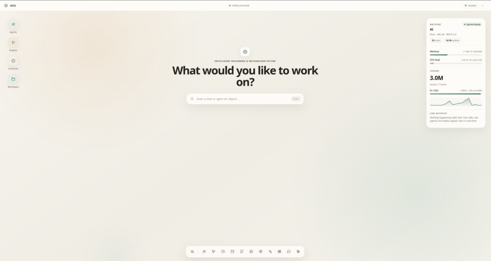
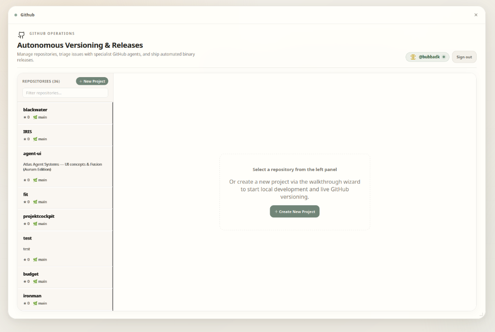
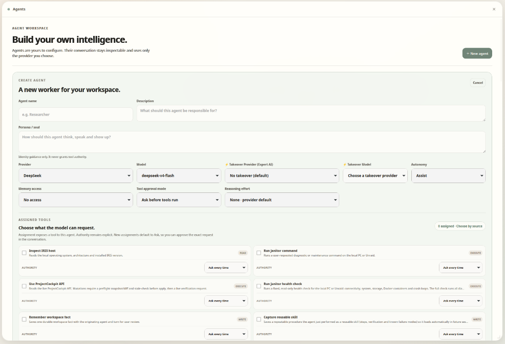
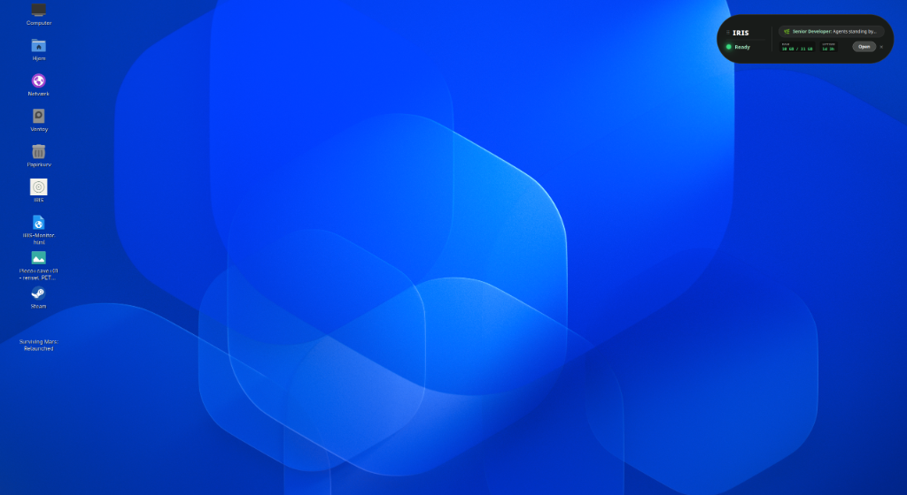
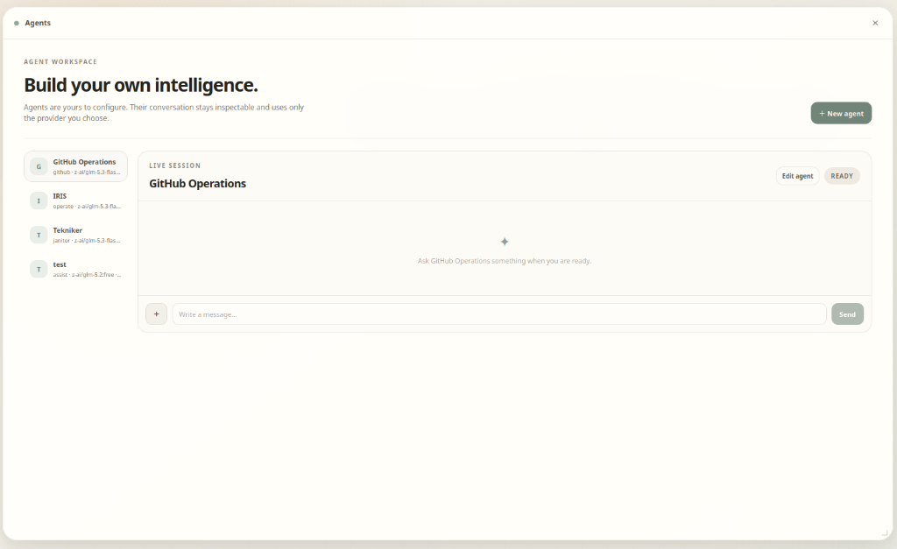
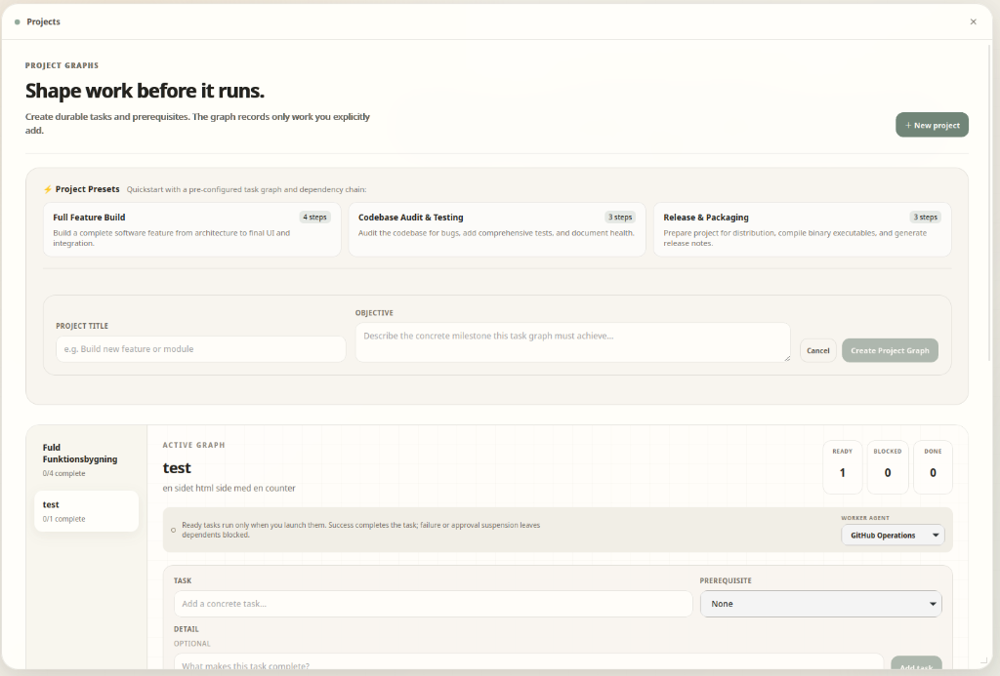

# IRIS · Intelligent Reasoning & Integration System

<div align="center">
  
  <h3>The Spatial Operating Environment for Autonomous AI Agents</h3>
  <p>An object-oriented, local-first desktop OS for creating, operating, and orchestrating autonomous AI agent systems.</p>

  [](https://github.com/bubbadk/IRIS/releases)
  [](LICENSE)
  [%20%7C%20macOS%20%7C%20Windows-amber.svg?style=flat-square)](https://github.com/bubbadk/IRIS/releases)
  [](https://github.com/bubbadk/IRIS)
</div>

<br />

<div align="center">
  
</div>

---

## 🌟 Why IRIS?

Most AI agent tools are just single-stream chat boxes with a generic dashboard attached. **IRIS is fundamentally different:**

IRIS is a **graphical agent operating environment**. It treats agents, workspaces, tools, memory graphs, and scheduled workflows as **first-class spatial desktop objects** that you can arrange, inspect, run concurrently, and monitor in real time.

- 🌿 **Warm, Calming Aesthetic**: Zero dark cyberpunk neon clichés or dense terminal grids. A serene, object-oriented desktop designed for deep work.
- ⚡ **Dual-Tier AI Architecture**: Run fast, affordable flash models for daily tasks, and seamlessly escalate to expert frontier models with instant **⚡ Takeover**.
- 🐙 **Live GitHub Release Engineering**: Autonomous issue triage, SemVer versioning, and CI/CD workflow automation that generates ready-to-run release binaries.
- 🛡️ **Zero-Surprise Security**: Interactive visual diff viewers, granular tool permission gating, and local OS Keyring credential storage.

```
                  ┌──────────────────────────────────────────────┐
                  │                 IRIS DESKTOP                 │
                  │   Spatial Object Windows & Command Stage     │
                  └──────────────┬────────────────┬──────────────┘
                                 │                │
             ┌───────────────────┴──┐          ┌──┴───────────────────┐
             │   Multi-Agent Cortex │          │   Live Telemetry HUD │
             │  Specialist Subagents│          │  Floating Mini Desklet│
             └───────────┬──────────┘          └──────────────────────┘
                         │
      ┌──────────────────┼──────────────────┬──────────────────┐
      ▼                  ▼                  ▼                  ▼
┌───────────┐      ┌───────────┐      ┌───────────┐      ┌───────────┐
│ GitHub    │      │ Workspace │      │  Vector   │      │ Provider  │
│ Operations│      │ Diff Gate │      │  Memory   │      │ (Ollama/  │
│ & CI/CD   │      │ Security  │      │ Retrieval │      │ OpenRouter│
└───────────┘      └───────────┘      └───────────┘      └───────────┘
```

---

## ✨ Key Features in v0.2.0

### 🐙 1. GitHub Live Operations & Release Automation
Turn your agent into a senior release engineer directly inside IRIS:

<div align="center">
  
</div>

- **Repository Explorer & Public/Private Toggling**: Inspect all your GitHub repositories with live stars, default branches, issue counts, and one-click visibility switching.
- **Autonomous Issue Triage**: Ask your GitHub specialist agent to inspect open issues, perform root-cause analysis, and draft surgical pull requests.
- **Automated SemVer Releases**: Tag new versions (`vMAJOR.MINOR.PATCH`), automatically author changelogs, and trigger GitHub Actions workflows to compile native distribution binaries (`.AppImage`, `.tar.gz`, `.exe`, `.dmg`).
- **4-Step Project Walkthrough Wizard**: Scaffold new projects locally, configure release pipelines, and push live when ready.

---

### ⚡ 2. Dual-Tier Intelligence & Instant "Takeover"
Stop overpaying for simple queries or getting stuck when a lightweight model hits a wall.

<div align="center">
  
</div>

- **Cost-Optimized Everyday Models**: Configure ultra-fast, budget-friendly models (e.g. *Qwen 2.5 Coder*, *DeepSeek V3*, *GPT-4o-mini*, *GLM 5.3 Flash*) for 90% of routine workflows.
- **⚡ Instant One-Click Takeover**: When encountering complex compiler errors or deep architectural refactoring, click **`⚡ Takeover`**. A pre-configured heavyweight reasoning model (*DeepSeek R1*, *Claude 3.7 Sonnet*, *Qwen 72B*) immediately takes over the active conversation context with full reasoning depth.

---

### 🛸 3. Floating Desktop Desklet (Live HUD)
Close the main workspace, and IRIS seamlessly condenses into a translucent, floating mini-HUD widget directly on your physical desktop:

<div align="center">
  
</div>

- **Live Status Pulse**: Shows real-time agent thoughts and states (`● Ready` / `● Working…`).
- **Activity Ticker**: Humanized tool action feed with specialist icons (`🤖 Specialist Sub-Agent`, `📁 Workspace Patch`, `💾 Memory Record`).
- **Real-Time Telemetry**: Live CPU load, RAM consumption, and system uptime.
- **One-Click Restore**: Expand back into the spatial workspace at any time.

---

### 🤖 4. Object-Oriented Agent Workspace & Tool Gating

<div align="center">
  
</div>

- **Autonomous Agent Personas**: Create and customize specialist workers with distinct autonomy levels (`Observe`, `Assist`, `Act`, `Operate`, `Janitor`, `GitHub`).
- **Granular Permission Controls**: Tools require explicit approval (`Ask every time`, `Allow Read-Only`, `YOLO mode`).
- **Secure OS Keyring**: API keys and tokens are securely managed via your native operating system keychain.

---

### 📊 5. Project Task Graphs & Presets

<div align="center">
  
</div>

- **Visual Dependency Graphs**: Define multi-step development milestones with strict prerequisite dependencies.
- **Built-in Engineering Presets**: Quickstart with 1-click templates for *Full Feature Build*, *Codebase Audit & Testing*, and *Release & Packaging*.
- **Worker Assignment**: Assign tasks to designated autonomous agents and monitor execution progress in real time.

---

## 🚀 Quickstart

### Download Standalone Release
Grab the latest pre-built binaries for your platform from [GitHub Releases](https://github.com/bubbadk/IRIS/releases):
- **Linux**: `.AppImage` (Recommended for Arch/CachyOS/Ubuntu/Fedora) or standalone binary
- **macOS**: `.dmg` (Universal binary for Apple Silicon & Intel)
- **Windows**: `.msi` / `.exe` installer

### Build from Source

#### Prerequisites
- [Node.js](https://nodejs.org/) v22+
- [pnpm](https://pnpm.io/) v10+
- [Rust](https://rustup.rs/) (latest stable toolchain)
- Linux build dependencies (Ubuntu/Debian: `sudo apt install libwebkit2gtk-4.1-dev libayatana-appindicator3-dev librsvg2-dev`)

#### 1. Clone & Install
```bash
git clone https://github.com/bubbadk/IRIS.git
cd IRIS
pnpm install
```

#### 2. Run in Development Mode
```bash
pnpm desktop
```

#### 3. Compile Standalone Linux Release Binary
```bash
pnpm build:binary
```
The compiled executable will be generated at `apps/desktop/src-tauri/target/release/iris`.

---

## 📁 Architecture & Monorepo Structure

IRIS is engineered as a clean, strictly typed TypeScript monorepo backed by a native Rust Tauri 2 shell:

| Package / App | Description |
| :--- | :--- |
| [`apps/desktop`](apps/desktop) | Tauri 2 native shell, React 19 spatial UI, Floating Desklet HUD, System Tray |
| [`packages/core`](packages/core) | Core domain types, agent models, autonomy rules, and validation |
| [`packages/github`](packages/github) | GitHub domain service, SemVer bumping, release scaffolding, and CI/CD pipelines |
| [`packages/agents`](packages/agents) | Multi-agent execution engine, state machines, and conversation repositories |
| [`packages/cortex`](packages/cortex) | Reasoning loop, subagent delegation, and autonomous turn execution |
| [`packages/mcp`](packages/mcp) | Model Context Protocol (MCP) client supporting Stdio, SSE, and HTTP transports |
| [`packages/memory`](packages/memory) | Vector embeddings, semantic search, and idle memory consolidation (Dreaming) |
| [`packages/providers`](packages/providers) | Unified LLM provider contracts (OpenRouter, Ollama, Anthropic, OpenAI, Gemini) |
| [`packages/skills`](packages/skills) | Sandboxed skill execution and capability scanning |
| [`packages/tools`](packages/tools) | Tool execution engine, audit trails, and permission policy enforcement |
| [`packages/workflows`](packages/workflows) | DAG task graphs, cron scheduler, and dreaming consolidation |
| [`packages/workspaces`](packages/workspaces) | Safe local directory mounting, patch generation, and visual diff tracking |

---

## 🧪 Testing & Verification

IRIS enforces strict modular boundaries and automated test coverage across both TypeScript and Rust:

```bash
# Run all TypeScript package & app test suites (Vitest)
pnpm test

# Run native Rust backend test suite
cargo test --manifest-path apps/desktop/src-tauri/Cargo.toml

# Strict typechecking & linting
pnpm typecheck
pnpm lint
```

---

## 📄 License

IRIS is open-source software licensed under the [MIT License](LICENSE).
