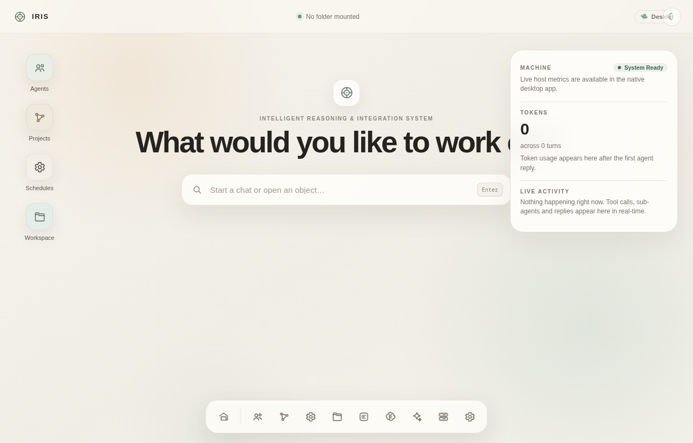
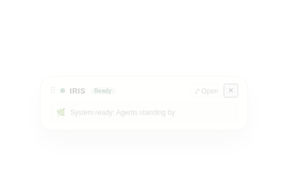
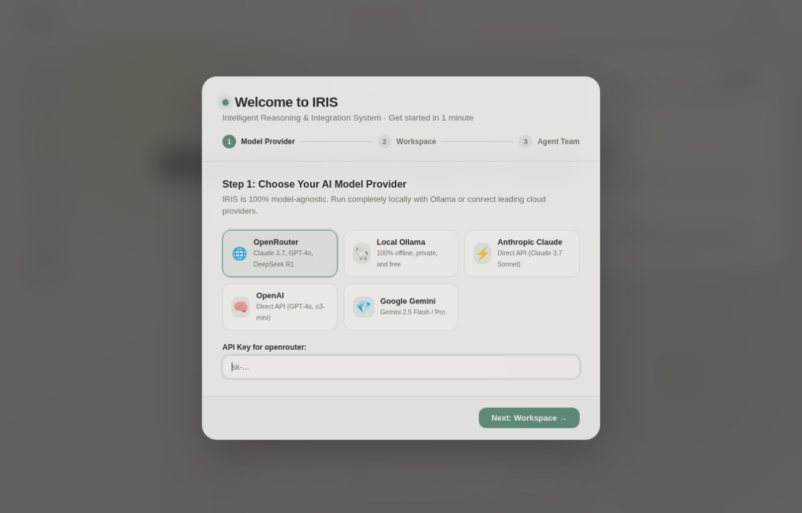

# IRIS · Intelligent Reasoning & Integration System

<div align="center">
  
  <h3>The Spatial Operating Environment for AI Agents</h3>
  <p>An object-oriented, local-first desktop OS for creating, operating, and orchestrating autonomous AI agents.</p>

  [](https://github.com/iris-systems/iris/actions/workflows/ci.yml)
  [](https://github.com/iris-systems/iris/actions/workflows/release.yml)
  [](LICENSE)
  [](https://github.com/bubbadk/IRIS/releases)
</div>

<div align="center">
  
</div>

---

## 🌟 Why IRIS?

Most AI agent tools are just single-stream chat boxes with an admin sidebar attached. **IRIS is fundamentally different:**

IRIS is a **graphical agent operating environment**. It treats agents, workspaces, tools, memory graphs, and scheduled workflows as **first-class spatial desktop objects** that you can arrange, inspect, run concurrently, and monitor in real time.

```
                  ┌──────────────────────────────────────────────┐
                  │                 IRIS DESKTOP                 │
                  │   Spatial Object Windows & Command Stage     │
                  └──────────────┬────────────────┬──────────────┘
                                 │                │
             ┌───────────────────┴──┐          ┌──┴───────────────────┐
             │   Multi-Agent Cortex │          │   Live Telemetry HUD │
             │  Specialist Subagents│          │  Floating Mini Desklet│
             └───────────┬──────────┘          └──────────────────────┘
                         │
      ┌──────────────────┼──────────────────┬──────────────────┐
      ▼                  ▼                  ▼                  ▼
┌───────────┐      ┌───────────┐      ┌───────────┐      ┌───────────┐
│ MCP Tools │      │ Workspace │      │  Vector   │      │ Provider  │
│  & Skills │      │ Diff Gate │      │  Memory   │      │ (Ollama/  │
│  Client   │      │ Security  │      │ Retrieval │      │ OpenRouter│
└───────────┘      └───────────┘      └───────────┘      └───────────┘
```

---

## ✨ Key Features

### 🛸 1. Floating Desktop Desklet (Live HUD)
Close the main window, and IRIS seamlessly transitions into a sleek, transparent, floating glass mini-HUD on your physical desktop.

<div align="center">
  
</div>

- **Live Status Pulse**: Shows real-time agent thoughts and states (`● Ready` / `● Working…`).
- **Activity Ticker**: Humanized tool action feed with specialist icons (`🤖 Specialist Sub-Agent`, `📁 Workspace Patch`, `💾 Memory Record`).
- **Telemetry**: Live CPU usage, RAM consumption, and system uptime.
- **One-Click Restore**: Expand back to the full spatial workspace at any time.

### 🤖 2. Specialist Sub-Agent Delegation & Autonomous Cortex
- Run specialized sub-agents concurrently (e.g. *Codebase Researcher*, *Senior Developer*, *System Janitor*).
- Real-time inline tool cards and streaming execution traces.
- Autonomous planning, reasoning effort configuration, and task graph orchestration.

### 🔌 3. Native Model Context Protocol (MCP) & Skills
- Connect to any standard MCP server (Stdio, SSE, HTTP).
- Capability scanning and safe execution gating.
- Rich tool permissions and audit trails.

### 🛡️ 4. Workspace Security & Interactive Diff Viewer
- Mount any local project folder safely.
- Built-in **Visual Diff Viewer**: Inspect exact code patches before approving writes.
- Live **Git Status & Branch** tracking right inside the workspace inspector.

### 🧠 5. Long-Term Vector Memory & Semantic Graph
- Episodic and semantic memory records with automatic embedding indexing.
- Background *Dreaming & Consolidation* processes that synthesize memories while idle.

### 🌐 6. 100% Model Agnostic & First-Run Onboarding
- **Local & Offline**: Native support for local LLMs via Ollama / vLLM.
- **Cloud Providers**: OpenRouter, Anthropic Claude (3.7 Sonnet), OpenAI (GPT-4o), Google Gemini.
- **3-Step Onboarding**: Get started in 1 minute with pre-configured specialist agents.

<div align="center">
  
</div>

---

## 🚀 Quickstart

### Pre-Built Binaries
Download the latest release for your platform from [GitHub Releases](https://github.com/bubbadk/IRIS/releases):
- **Linux**: `.AppImage` (Run directly) or `.deb`
- **macOS**: `.dmg` (Universal for Intel & Apple Silicon)
- **Windows**: `.msi` / `.exe` installer

### Build from Source

#### Prerequisites
- [Node.js](https://nodejs.org/) v22+
- [pnpm](https://pnpm.io/) v10+
- [Rust](https://rustup.rs/) (latest stable)
- Linux build dependencies (Ubuntu/Debian: `sudo apt install libwebkit2gtk-4.1-dev libayatana-appindicator3-dev librsvg2-dev`)

#### 1. Clone & Install
```bash
git clone https://github.com/iris-systems/iris.git
cd iris
pnpm install
```

#### 2. Run in Development Mode
```bash
pnpm desktop
```

#### 3. Build Standalone Release Binary
```bash
pnpm build:binary
```
The compiled executable will be located at `apps/desktop/src-tauri/target/release/iris`.

---

## 📁 Repository Structure

IRIS is engineered as a clean, strictly typed TypeScript monorepo with a high-performance Tauri 2 Rust backend:

| Package / App | Description |
| :--- | :--- |
| [`apps/desktop`](apps/desktop) | Tauri 2 native shell, React 19 spatial UI, Desktop Desklet HUD, System Tray |
| [`packages/core`](packages/core) | Core domain types, object models, and schema validation |
| [`packages/agents`](packages/agents) | Multi-agent runtime, state machines, and conversation repositories |
| [`packages/cortex`](packages/cortex) | Reasoning loop, turn execution, and sub-agent delegation |
| [`packages/mcp`](packages/mcp) | Model Context Protocol client (stdio & SSE transports) |
| [`packages/memory`](packages/memory) | Vector embeddings, semantic search, and retrieval pipelines |
| [`packages/providers`](packages/providers) | Unified provider contracts (Ollama, OpenRouter, Anthropic, OpenAI, Gemini) |
| [`packages/skills`](packages/skills) | Skill catalog, capability analysis, and sandboxed execution |
| [`packages/tools`](packages/tools) | Tool execution framework, permission rules, and audit logging |
| [`packages/workflows`](packages/workflows) | DAG task graphs, cron scheduler, and dreaming consolidation |
| [`packages/workspaces`](packages/workspaces) | Safe local folder mounting, patch generation, and Git integration |

---

## 🧪 Testing & Code Quality

IRIS adheres to strict architectural boundaries with 100% test coverage for core behavior:

```bash
# Run all TypeScript package & app test suites (Vitest)
pnpm test

# Run native Rust backend test suite
cargo test --manifest-path apps/desktop/src-tauri/Cargo.toml

# Typecheck and lint
pnpm typecheck
pnpm lint
```

---

## 🤝 Contributing

Contributions are warmly welcomed! Please see [CONTRIBUTING.md](CONTRIBUTING.md) for development guidelines and our code of conduct.

---

## 📄 License

IRIS is open-source software licensed under the [MIT License](LICENSE).
